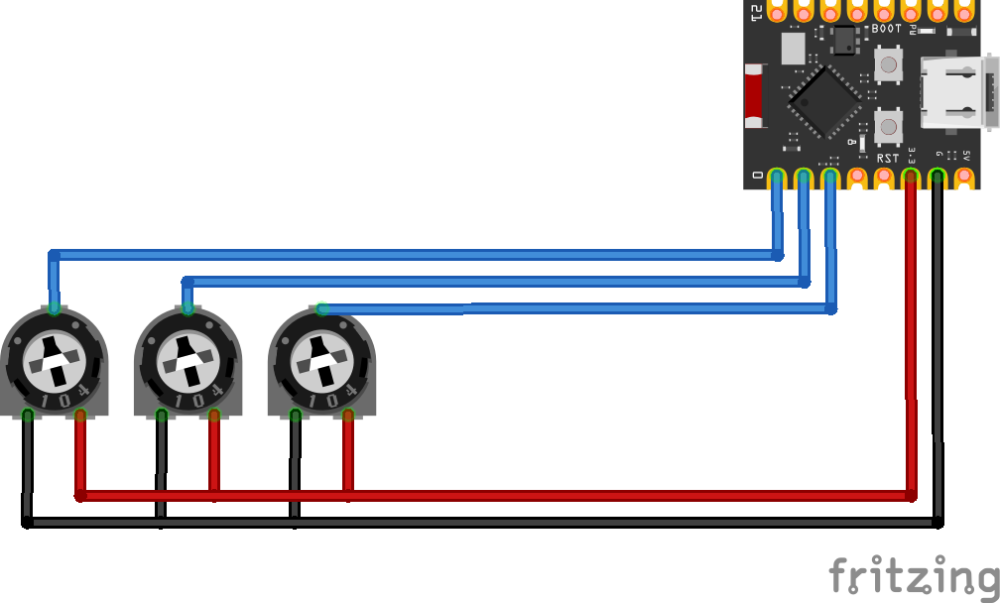
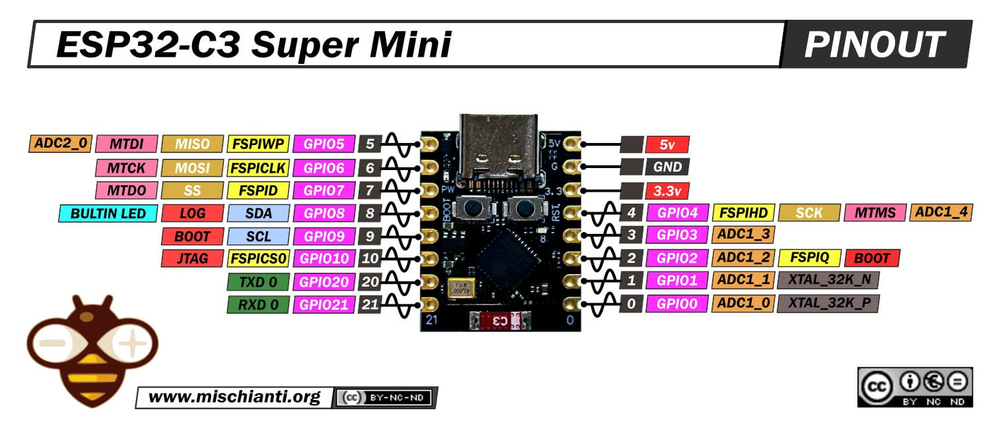

# Firmware v0.0.1

Versión inicial del firmware para ESP32-C3 Super Mini. Solo lee los 3 potenciómetros
(índice, medio, pulgar) y vuelca sus valores analógicos crudos (0-4095) por el puerto
serie cada 100ms, sin ninguna lógica de mensajes ni tramos.

## Código

Archivo: [`hardware/archive/v0-0-1.cpp`](../hardware/archive/v0-0-1.cpp)

- Pines: `pinIndice` (GPIO0), `pinMedio` (GPIO1), `pinPulgar` (GPIO2).
- `analogRead()` sobre cada pin, impresión por `Serial` a 115200 baudios.
- `delay(100)` entre lecturas.

## Esquemático

Pinout de referencia del ESP32-C3 Super Mini:

Proyecto Fritzing: [`hardware/schematics/Fritzing/v0-0-1.fzz`](../hardware/schematics/Fritzing/v0-0-1.fzz)

## Limitaciones

- No traduce el valor analógico a un mensaje: solo depuración/calibración de umbrales.
- Sin filtrado de ruido ni debounce.
